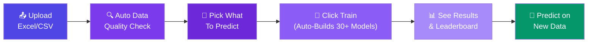
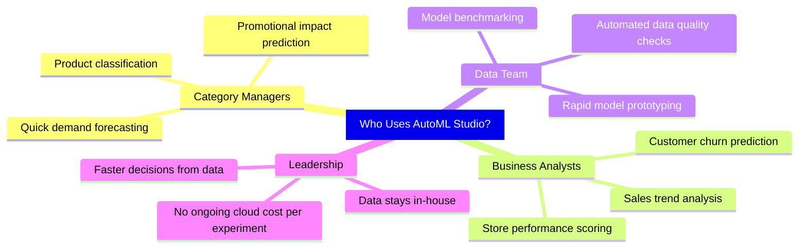
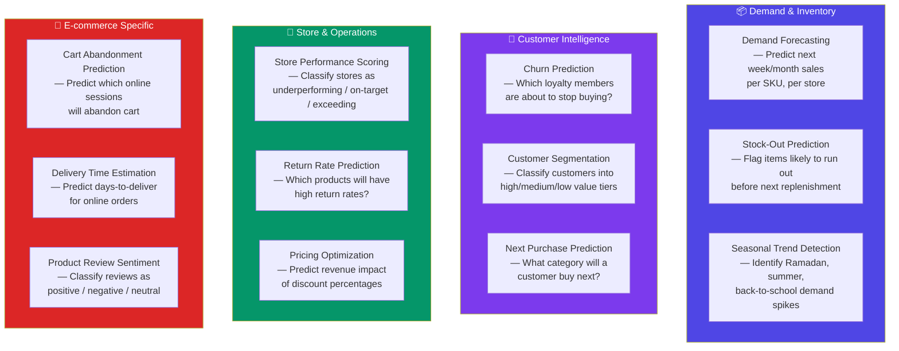
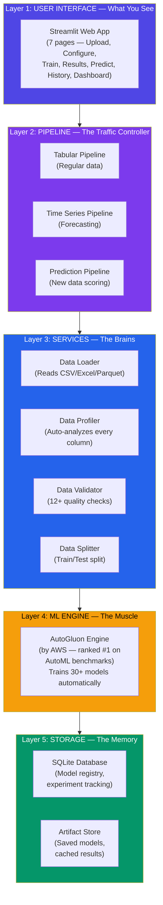
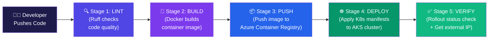
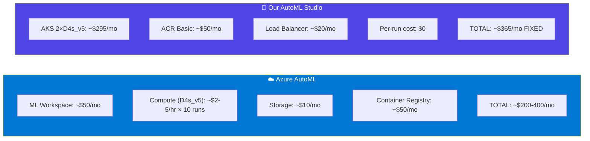
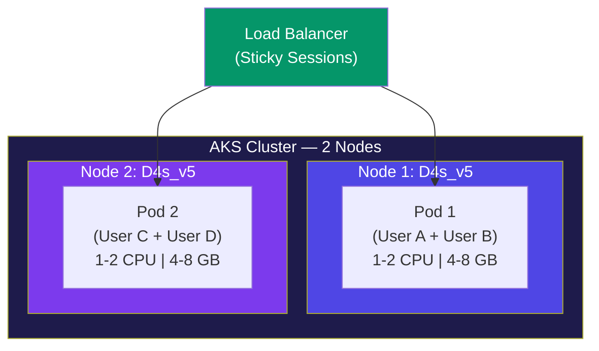
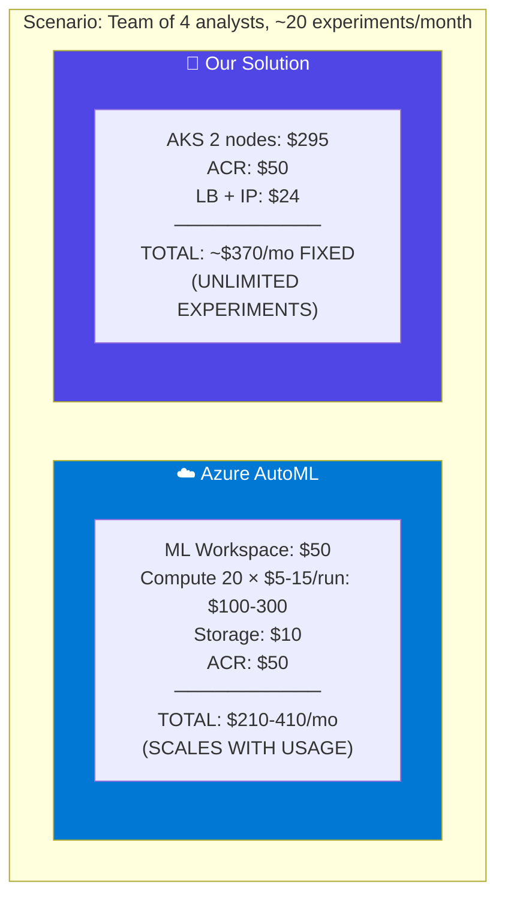
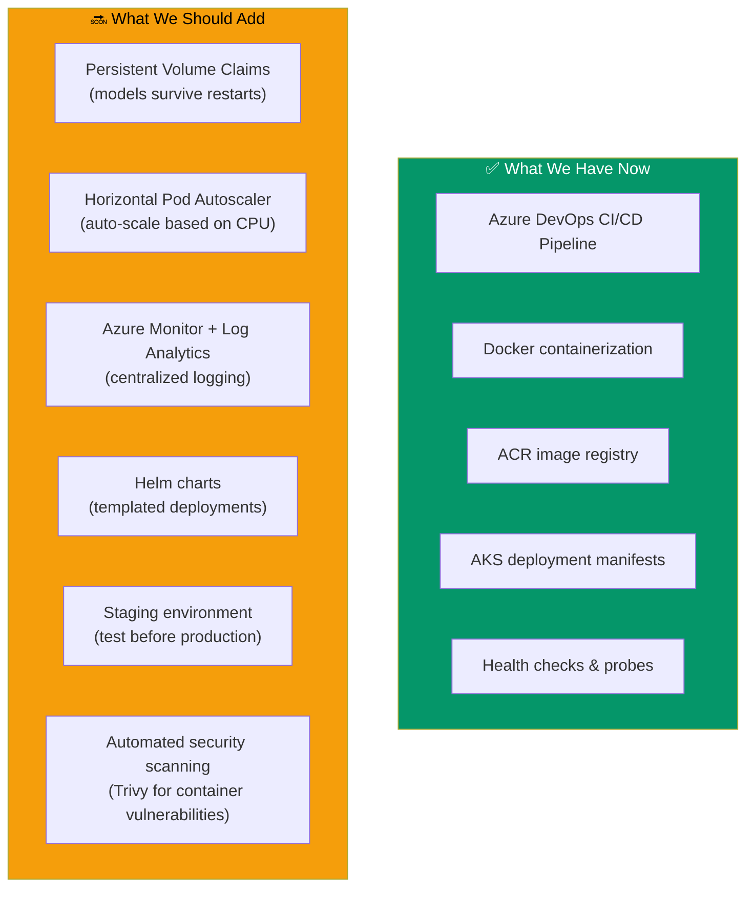

# 🤖 Universal AutoML Studio — Executive Presentation
### ML As A Service | Built for Alshaya Retail

**Prepared by:** Naseer Hussain
**Date:** October 2026
**Duration:** ~15 minutes

---

## 📋 Agenda (What We'll Cover)

| # | Topic | Time |
|---|---|---|
| 1 | What is this application? | 2 min |
| 2 | What problem does it solve? | 2 min |
| 3 | Retail & E-commerce use cases | 2 min |
| 4 | How the application works (Architecture) | 3 min |
| 5 | How we built it (Implementation) | 2 min |
| 6 | Why this is better than Azure AutoML | 2 min |
| 7 | AKS deployment cost breakdown | 1 min |
| 8 | What's next — improvements & DevOps | 1 min |

---

## 1️⃣ What Is This Application? (The 30-Second Pitch)

**Universal AutoML Studio** is a **self-hosted web application** that lets anyone — business analysts, category managers, or data teams — build machine learning models **without writing any code**.

**In plain English:** You upload an Excel or CSV file, pick what you want to predict (e.g., "will this customer churn?", "what will next month's sales be?"), click one button, and the system automatically:

1. ✅ Checks your data quality (missing values, duplicates, errors)
2. ✅ Picks the right type of prediction (yes/no answer vs. a number)
3. ✅ Trains and tests **20-30+ different AI models** at once
4. ✅ Ranks them from best to worst on a leaderboard
5. ✅ Lets you download predictions on new data

> [!IMPORTANT]
> **Key takeaway:** This is like having an AI data scientist available 24/7, that works in minutes instead of weeks, costs nothing per use, and keeps your data private.



---

## 2️⃣ What Problem Does It Solve?

### The Pain We Had Before

| Problem | Before (Old Way) | After (AutoML Studio) |
|---|---|---|
| **Who can build AI models?** | Only data scientists who know Python coding | Any business analyst who knows Excel |
| **How long does it take?** | 2-4 weeks of coding, testing, iterating | 5-30 minutes, fully automatic |
| **What does it cost per use?** | Azure AutoML bills per compute hour ($$$) | Zero per-run cost — fixed infrastructure |
| **Where does our data go?** | Uploaded to Microsoft Azure cloud | Stays on OUR servers — never leaves |
| **Are we locked to one vendor?** | Yes, tied to Azure ML ecosystem | No — fully open-source, move anywhere |
| **Can we repeat past results?** | Hard — manual notebooks are messy | Yes — smart caching ensures exact same results |

### Who Benefits?



---

## 3️⃣ Retail & E-commerce Use Cases — Where This Shines

> [!TIP]
> This section is specifically tailored to **Alshaya's retail/e-commerce operations** and similar brands.

### High-Impact Use Cases for Retail



### Concrete Example — How a Category Manager Would Use This

| Step | What Happens | Time |
|---|---|---|
| 1 | Category Manager exports last 12 months of **store-level weekly sales** from SAP/Oracle into a CSV | 2 min |
| 2 | Uploads the CSV to AutoML Studio | 30 sec |
| 3 | App automatically profiles the data — shows 15,000 rows, 12 columns, 2% missing values | Instant |
| 4 | Manager selects **"next_week_sales"** as the prediction target | 10 sec |
| 5 | Clicks **"Train"** — system builds 30+ models (gradient boosting, neural nets, ensembles) | 5-20 min |
| 6 | Leaderboard shows best model has **R² = 0.87** (87% accuracy in predicting sales) | Instant |
| 7 | Manager uploads **next week's store schedule** and downloads predictions | 1 min |
| **Total** | From raw data to demand forecast | **~25 min** |

> [!NOTE]
> The same process with traditional data science would take **2-4 weeks** (writing Python code, cleaning data manually, trying different models, evaluating results, creating reports).

---

## 4️⃣ Application Architecture — How It Works (Simple)

Think of this application as a **5-layer cake** — each layer does one specific job:



### What Each Layer Does (Plain English)

| Layer | What It Does | Analogy |
|---|---|---|
| **UI Layer** | The web page you interact with — upload files, click buttons, see results | The **restaurant menu** — you order here |
| **Pipeline Layer** | Coordinates all the steps from data upload to final prediction in the right sequence | The **head chef** — manages the kitchen workflow |
| **Service Layer** | Individual specialists — one reads files, one checks quality, one splits data | The **line cooks** — each has a specialty |
| **ML Engine** | The actual AI brain — AutoGluon trains 30+ different models and picks the best ones | The **master chef** — creates the actual dish |
| **Storage Layer** | Remembers everything — every model, every result, never retrains the same thing twice | The **recipe book** — stores all past work |

### Technical Details for Each Stage

**Stage 1 — Data Upload & Profiling:**
- Supports CSV, TSV, Excel (.xlsx with multi-sheet), and Parquet files
- Auto-detects file encoding (handles Arabic, Asian, European data)
- Scans every column: data type, missing values, unique counts, duplicates
- Flags potential ID columns, date columns, and high-cardinality fields

**Stage 2 — Data Validation (12+ Automated Checks):**
- Empty/small dataset detection
- Duplicate columns and rows
- Missing value thresholds
- Data leakage detection (prevents cheating models)
- Class imbalance warnings (e.g., 95% "No Fraud" vs 5% "Fraud")

**Stage 3 — Smart Data Splitting:**
- Random split (80% train / 20% test)
- Stratified split (preserves class proportions)
- Temporal split (for time-ordered data — older = train, newer = test)

**Stage 4 — Model Training (AutoGluon):**
- Trains 20-30+ models: Gradient Boosting (XGBoost, LightGBM, CatBoost), Neural Networks, Random Forests, and Ensembles
- Uses **multi-layer stacking** — trains models on top of other models for better accuracy
- Auto-handles missing values, categorical encoding, feature engineering

**Stage 5 — Results & Prediction:**
- Ranked leaderboard of all models
- Evaluation charts (confusion matrix, ROC curves, actual vs. predicted)
- Download predictions as CSV
- Feature importance (which columns matter most)

---

## 5️⃣ How It Is Implemented (Tech Stack)

### Technology Choices

| Component | Technology | Why We Chose It |
|---|---|---|
| **Web UI** | Streamlit (Python) | Fastest way to build interactive ML apps — no frontend coding needed |
| **ML Engine** | AutoGluon (by AWS) | Ranked #1 in AutoML benchmarks — beats Azure AutoML on tabular data |
| **Database** | SQLite | Zero setup, file-based, perfect for single-app deployments |
| **Configuration** | Pydantic + YAML | Validates all settings at startup — catches errors early |
| **Containerization** | Docker | One-command deployment anywhere — laptop, server, or cloud |
| **CI/CD** | Azure DevOps Pipelines | Automated lint → build → push to ACR → deploy to AKS |
| **Orchestration** | Kubernetes (AKS) | Handles scaling, health checks, rolling updates, self-healing |
| **Language** | Python 3.10 | Industry standard for ML/data science |

### Codebase Overview

```
Total Source Files:    30+ modules
Main Application:     1,582 lines (app.py — the complete Streamlit UI)
Backend Services:     Data, AutoML, Registry, Pipelines, Evaluation, Utils
Architecture Style:   Clean layered — each module has one responsibility
```

### DevOps Pipeline — From Code to Production



**What happens at each DevOps stage:**

| Stage | What Happens | Why It Matters |
|---|---|---|
| **Lint** | Ruff scans all Python code for errors, style issues, and potential bugs | Catches problems before they reach production |
| **Build** | Docker packages the entire app + all dependencies into a single container image | Ensures it runs exactly the same everywhere |
| **Push to ACR** | Image is uploaded to Azure Container Registry (our private Docker Hub) | Secure, private storage for our container images |
| **Deploy to AKS** | Kubernetes manifests are applied — namespace, configmap, deployment, service | The app goes live on our AKS cluster |
| **Verify** | Checks rollout status and retrieves the external IP address | Confirms deployment succeeded and gives us the URL |

---

## 6️⃣ Why This Is Better Than Azure AutoML (For Our Use Case)

### Side-by-Side Comparison

| Dimension | ☁️ Azure AutoML | 🤖 Our AutoML Studio | Winner |
|---|---|---|---|
| **Cost per experiment** | Pay per compute hour (can be $5-50+ per run) | Zero — fixed infrastructure cost | ✅ Ours |
| **Where does data go?** | Microsoft Azure cloud (outside our control) | Stays on our servers — never leaves | ✅ Ours |
| **Setup complexity** | Azure subscription + ML workspace + compute cluster + storage account | `docker run` — one command | ✅ Ours |
| **Who can use it?** | Needs Azure ML Studio knowledge | Anyone who can use a web browser | ✅ Ours |
| **AI engine quality** | Microsoft's proprietary engine | AutoGluon — ranked #1 on tabular benchmarks | ✅ Ours |
| **Multi-table joins** | Manual — user must join tables before upload | Built-in smart join with fuzzy matching | ✅ Ours |
| **Caching** | None — retrain every time | Smart fingerprinting — never retrains same data + config | ✅ Ours |
| **Works offline?** | ❌ Needs internet | ✅ Fully offline capable | ✅ Ours |
| **GPU training** | ✅ Yes — massive GPU clusters | ❌ CPU only (for now) | ☁️ Azure |
| **Enterprise scale** | ✅ Designed for 100+ users | Designed for 3-10 users | ☁️ Azure |
| **MLOps maturity** | ✅ Full model registry, endpoints, monitoring | Basic — SQLite registry, no REST API yet | ☁️ Azure |

### Cost Comparison — 10 Experiments Per Month



> [!IMPORTANT]
> **The key difference:** Azure AutoML costs **scale with usage** — the more experiments you run, the more you pay. Our solution has a **fixed cost** — whether you run 5 experiments or 500 experiments per month, the infrastructure cost stays the same. **For a team that experiments frequently, our solution pays for itself within 1-2 months.**

### The AutoGluon Advantage

Our engine (AutoGluon, developed by AWS) uses a technique called **multi-layer stacking**:
- It trains dozens of different model types (tree-based, neural networks, etc.)
- Then it trains NEW models on top of those models' predictions
- This "stacking" approach consistently **outperforms Azure AutoML on tabular/spreadsheet data** in academic benchmarks

---

## 7️⃣ AKS Deployment Cost Breakdown (3-4 Users, 2 Nodes)

### Recommended Setup for 3-4 Users

| Component | Specification | Monthly Cost (Central India) |
|---|---|---|
| **AKS Control Plane** | Free tier (no SLA) | **$0** |
| **Node 1** | Standard_D4s_v5 (4 vCPU, 16 GB RAM) | **~$147/mo** |
| **Node 2** | Standard_D4s_v5 (4 vCPU, 16 GB RAM) | **~$147/mo** |
| **OS Disks** | 2 × 128 GB Premium SSD (P10) | **~$40/mo** |
| **Azure Container Registry** | Basic tier (10 GB included) | **~$50/mo** |
| **Load Balancer** | Standard (for external access) | **~$20/mo** |
| **Public IP** | 1 static IP | **~$4/mo** |
| **Data Egress** | Minimal (internal app, low traffic) | **~$5/mo** |
| | | |
| **💰 TOTAL (Pay-As-You-Go)** | | **~$413/mo (~₹34,500/mo)** |

### How This Supports 3-4 Users



- **2 pods** (1 per node) — each pod comfortably handles **2 concurrent users**
- **Sticky sessions** ensure a user stays on the same pod (critical for Streamlit)
- Each pod gets **1 CPU base / 2 CPU burst** and **4 GB base / 8 GB burst** memory
- Total cluster capacity: **8 vCPU, 32 GB RAM** — plenty for 4 users

### 💡 Cost Optimization Strategies

| Strategy | Savings | New Monthly Cost | Tradeoff |
|---|---|---|---|
| **1-Year Reserved Instances** | ~38% off compute | **~$280/mo** | Must commit for 12 months |
| **3-Year Reserved Instances** | ~55% off compute | **~$230/mo** | Must commit for 36 months |
| **Use D2s_v5 nodes** (2 vCPU, 8 GB) instead | ~50% off compute | **~$260/mo** | Less headroom for large datasets |
| **B2ms (Burstable) nodes** for dev/test | ~60% off compute | **~$200/mo** | Not ideal for training workloads |
| **Stop cluster off-hours** (12 hrs/day) | ~50% off compute | **~$260/mo** | Not available outside business hours |
| **Single node** (if only 1-2 users) | ~35% off total | **~$280/mo** | No redundancy, single point of failure |

> [!TIP]
> **Best strategy for production:** Use **1-Year Reserved Instances** for the 2 D4s_v5 nodes + **stop/start** during off-hours. Combined savings: **~$180-200/mo (~₹15,000-17,000/mo)**.

### Cost Comparison: Ours vs Azure AutoML (For Same Work)



**Bottom line:** At ~20+ experiments per month, our fixed-cost solution **breaks even or beats** Azure AutoML. And as usage grows, Azure costs keep climbing while ours stays flat.

---

## 8️⃣ What We Can Improve From Here

### Immediate Improvements (Next 1-3 Months)

| Improvement | Business Value | Effort |
|---|---|---|
| **Add REST API endpoints** (`/train`, `/predict`) | Other systems (Power BI, internal apps) can call our ML models programmatically | Medium |
| **SHAP Explainability Dashboard** | Show business users **why** the model made each prediction — builds trust | Medium |
| **Automated retraining** (daily/weekly) | Models auto-update on new data — critical for demand forecasting that drifts | Medium |
| **Proper test suite** | Replace placeholder tests with real ones — ensures reliability | Low |
| **Azure Blob Storage** for artifacts | Models survive pod restarts — currently lost if pod restarts | Medium |

### Medium-Term (3-6 Months)

| Improvement | Business Value | Effort |
|---|---|---|
| **Multi-user authentication** (Azure AD) | Multiple teams can use it securely with role-based access | High |
| **Model comparison view** | Side-by-side comparison of two models on same dataset | Low |
| **Data drift detection** | Alert when new data looks different from training data | Medium |
| **GPU support** | 10x faster training on large datasets | Medium |
| **Email/Teams notifications** | "Your model is done training" — no need to watch the screen | Low |

### Long-Term Vision (6-12 Months)

| Improvement | Business Value | Effort |
|---|---|---|
| **Natural language queries** | "Show me churn prediction for customers with 5+ orders" | High |
| **A/B model testing** | Serve 2 models and measure which performs better | High |
| **FastAPI migration** | Production-grade backend with async processing & queuing | High |
| **ONNX model export** | Deploy models in non-Python environments (mobile, edge) | Medium |

### DevOps Improvements



---

## 🎯 Summary — Key Takeaways for Decision Makers

| Question | Answer |
|---|---|
| **What is it?** | A self-hosted, no-code AI/ML platform for business analysts |
| **What problem does it solve?** | Removes the need for data scientists for standard prediction tasks — anyone can build ML models in minutes |
| **Is it proven technology?** | Yes — built on AutoGluon (AWS), ranked #1 in AutoML benchmarks for tabular data |
| **How does it compare to Azure AutoML?** | Better for our use case: cheaper (fixed cost), data stays private, simpler to use, and the AI engine is equal or better for spreadsheet data |
| **Where can retail/e-commerce use it?** | Demand forecasting, churn prediction, customer segmentation, return prediction, store scoring, cart abandonment, pricing optimization |
| **What does it cost to run?** | ~$370/mo for 4 users (can optimize to ~$200/mo with reservations + off-hours shutdown) |
| **Is it production-ready?** | For testing/POC: yes. For full production: needs persistent storage, authentication, and monitoring |
| **What's the roadmap?** | REST API → Explainability → Auto-retraining → Multi-user auth → GPU support |

> [!IMPORTANT]
> **The bottom line:** For a team of 3-4 retail analysts running 20+ experiments per month, this platform **saves $1,500-3,000/year vs Azure AutoML** while keeping data private and providing a simpler user experience. The AI engine (AutoGluon) is equal or better than Azure's for the kind of spreadsheet data we work with in retail.

---

*This document covers the complete application based on analysis of 30+ source modules, CI/CD pipelines, Kubernetes manifests, and Dockerfile configurations.*
